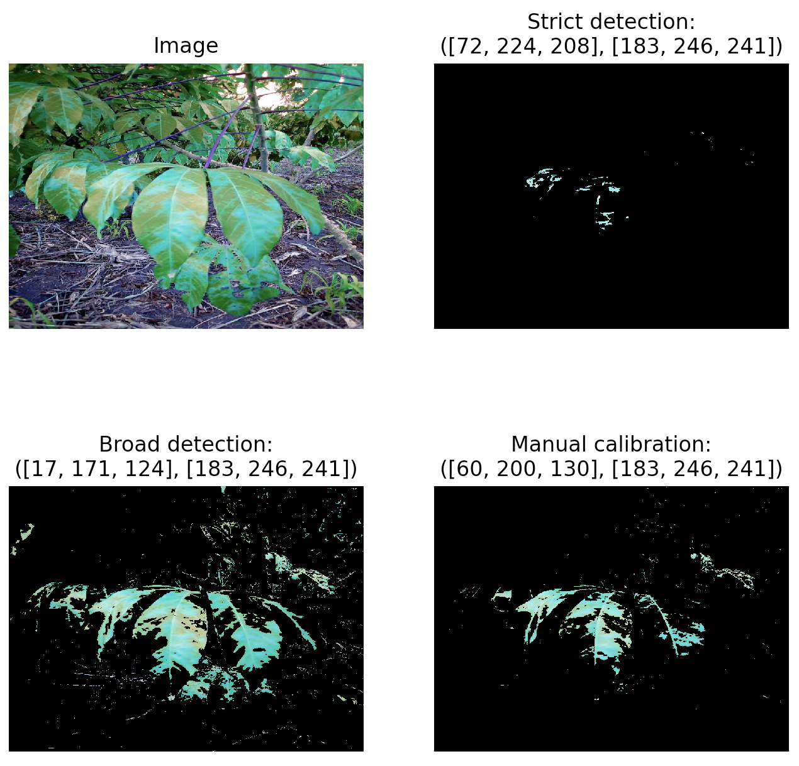

# experiments
This repo contains our experimental approaches for the Cassava Leaf Disease Classification.

Diseases:
  - (1) *Cassava green mottle* [MEDIUM]: Look for yellow patterns on the leaves, from small dots to irregular patches of yellow and green. Look for leaf margins that are distorted. The plants may be stunted. Our data set also contains **dark brown streaks on the stem** for this class. [More here](https://www.pestnet.org/fact_sheets/cassava_green_mottle_068.htm)
  - (2) *Cassava bacterial blight* [HARD]: Look to see if leaves are drying and dying early. Look for angular spots on the leaves, and cut out small pieces of the leaf from the edge of the spots and place them in a drop of water. Look for bacterial streaming - the streaming appears as white streaks in the water. Look for **dark brown to black streaks on the green part of the stem**, and for the presence of sticky liquid. Look for browning in the vascular tissues, i.e., the water conducting tubes, after peeling the bark and splitting the stem. [More here](https://www.pestnet.org/fact_sheets/cassava_bacterial_blight_173.htm?zoom_highlight=Cassava+Bacterial+Blight)
  - (3) *Cassava Brown Streak Disease* [EASY - MEDIUM]: chlorotic or necrotic vein banding in mature leaves which may merge later to form large yellow patches [More here](https://plantvillage.psu.edu/topics/cassava-manioc/infos/diseases_and_pests_description_uses_propagation)
  - (4) *Cassava Mosaic Disease* [EASY - MEDIUM]: Discolored pale green, yellow or white mottled leaves which may be distorted with a reduced size; in highly susceptible cassava cultivars plant growth may be stunted, resulting in poor root yield and low quality stem cuttings. Note that infected plants can express a range of symptoms and the exact symptoms depend on the species of virus and the strain as well as the environmental conditions and and the sensitivity of the cassava host; (1) Patches of discolouration (chlorosis) in the leaves that vary from yellow to green; (2) The leaves display size variation and are often severely distorted; (3) Leaf blades sometimes fold depending on severity shrivel. [More here](https://plantvillage.psu.edu/topics/cassava-manioc/infos/diseases_and_pests_description_uses_propagation)

Dataset overview:
```
training set size:  42794
one image flatten size:  1440000
size distribution:  {
    '1': 1087, 
    '2': 2189, 
    '3': 2386, 
    '4': 13158, 
    '5': 2577
}
```

What are we trying to do atm:
  - Data Analysis and Preprocessing: 
    - [x] similarity with some Monte Carlo simulations [Article on LPIPS](https://arxiv.org/abs/1801.03924) [Article on Color Space information retrieval](https://www.sciencedirect.com/science/article/pii/S187770581100021X)
      ```
      Input: number of images loaded := 100, experiment sample size := 10, number of simulations := 10
      Runtime:             LPIPS              PSNR                SSIM
      Simulation #1: 0.6593322157859802, 9.47935962677002, 0.09285126626491547
      Simulation #2: 0.6850652098655701, 9.902604103088379, 0.08222384750843048
      Simulation #3: 0.6983931660652161, 9.53113079071045, 0.0811685174703598
      Simulation #4: 0.6989937424659729, 9.27914810180664, 0.09771811217069626
      Simulation #5: 0.6332558989524841, 9.030553817749023, 0.05319840461015701
      Simulation #6: 0.6239102482795715, 10.159566879272461, 0.06416226178407669
      Simulation #7: 0.6591953635215759, 9.76210880279541, 0.07119724154472351
      Simulation #8: 0.6343691945075989, 9.308271408081055, 0.07333287596702576
      Simulation #9: 0.658652126789093, 9.396651268005371, 0.09231053292751312
      Simulation #10: 0.6619075536727905, 10.314115524291992, 0.08350417762994766
      Overview:
      Metric        Value
      --------  ---------
      LPIPS     0.661307
      PSNR      9.61635
      SSIM      0.0791667
      ```
    - [x] color detection for (1), (3), and (4)
      
    - [ ] streak removal from BSD, keeping only the leaves
    - [ ] blurriness control
    - [x] denoising filters
      [Results](https://i.imgur.com/xy0l6V6.png)
    - [x] background/foregroung segmentation
      [Results](https://i.imgur.com/AjT50es.png)
    
  - [ ] EfficientNet
    - [ ] Analysis of what went wrong
    - [ ] Accuracy analysis
    - [ ] Hyper-params 
    - [ ] Build some testing API/GUI
  - [ ] ViT (?)
